# Synthetic Data Creation for the Improvement of the Performance of Classifiers.

In training a classifier, it is useful to include, in the training dataset, augmented and synthetic data where that extra data improves the performance of the classifier on the validation and test sets.

In this project, I will create synthetic data which can be later used in a radiology project. The synthetic data I will create is of foreign bodies within chest X-rays. I will take a dataset of raw chest X-rays, and, using computer vison techniques, I will insert foreign bodies into them and compare them to real cases. 

I will also train a classifier on this synthetic data. In practice, the model that I trained should be loaded as a pre-trained model for additional training on real data. I hypothesize that my model achieves superior results.
In my project proposal, I suggested that I would apply those methods to Computer Tomography volumes additionally. Unfortunately, the shortage of GPUs available in cloud services meant that the training on CT volumes became prohibitively time and resource intensive on CPUs. The same goes for the visualization of CT volumes. I have not included the CT volumes in this final report, although I did load and view slices of the dataset from my project proposal (kits19/kits21).


## Part I - Binary classification of chest X-rays for 'swallowed coin'
#### Adapted from fastai tutorial https://docs.fast.ai/tutorial.medical_imaging.html


> In Part I we will build a classifier that distinguishes between chest X-rays with a swallowed coin and chest X-rays without a swallowed coin. The coin in these images is always seen face-on, and has not been rotated. The image data is loaded from a local dataset of modified DICOM source files, which have been derived from a dataset of 250 chest X-rays that are included in the fastai package. DICOM data is handled directly. This notebook also goes through basic data exploration.

## Foreign body impacted in oesophagus

Sometimes patients will accidentally inhale or swallow a foreign body. These can include things like (commonly) coins, nuts, a food bolus, debris, or even their own dentures. Many  objects will be lodged in the trachea (windpipe) on the way down. Coins are more common in children than adults. Any foreign body in the airway can be an emergency, as even if it doesn't obstruct, it can cause trauma and bleeding, which may then subsequently result in obstruction.

I have chosen to make a classifier on swallowed coins as Part I of my project because a coin is a simple shape, and I am using an 'artificial' or 'synthetic' dataset where I am adding in the coins with openCV (see my other notebook 'Create_modified_dataset' to see how I modify the pixels in the DICOM files via numpy).

Here is what a coin in the oesophagus looks like on Chest X-ray (this is a real image, and I have not modified it). Coins can sometimes look like this if they are in the trachea, but much more often they are viewed side-on not face-on.


## Loading of X-ray DICOM files

First, we will define a path to the _siim_small_ folder containing a subset (250 DICOM files, \~30MB) of the [SIIM-ACR Pneumothorax Segmentation](https://doi.org/10.1007/s10278-019-00299-9) \[1\] dataset, which I have modified to include an artificial feature, a filled white circle, which resembles a coin, placed at a random location close to the trachea. I have added this 'coin' feature to these chest X-rays because no available dataset of chest X-rays exists for coin-like foreign bodies, so I have created my own. 


```python
pneumothorax_source =  Path('mod_dataset/siim_small')
```

The _siim_small_ folder has a specific directory/file structure with folders like 'pneumothoarax' and 'no pneumothorax', which was appropriate for the tutorial goal, which was the classification of chest X-rays by pneumonthorax presence. I have kept the folder structure the same to preserve that information, but I have used my own labels which are drawn from a dataframe. That's why the term pneumothorax keeps popping up - because I'm adapating from that dataset.

### Plotting the DICOM data


```python
df = pd.read_csv(pneumothorax_source/f"labels.csv")
df = df.rename(columns = {"calculus": "coin"})
df.head()
```


<div>
<style scoped>
    .dataframe tbody tr th:only-of-type {
        vertical-align: middle;
    }

    .dataframe tbody tr th {
        vertical-align: top;
    }

    .dataframe thead th {
        text-align: right;
    }
</style>
<table border="1" class="dataframe">
  <thead>
    <tr style="text-align: right;">
      <th></th>
      <th>file</th>
      <th>label</th>
      <th>coin</th>
    </tr>
  </thead>
  <tbody>
    <tr>
      <th>0</th>
      <td>train/No Pneumothorax/000000.dcm</td>
      <td>No Pneumothorax</td>
      <td>False</td>
    </tr>
    <tr>
      <th>1</th>
      <td>train/Pneumothorax/000001.dcm</td>
      <td>Pneumothorax</td>
      <td>False</td>
    </tr>
    <tr>
      <th>2</th>
      <td>train/No Pneumothorax/000002.dcm</td>
      <td>No Pneumothorax</td>
      <td>False</td>
    </tr>
    <tr>
      <th>3</th>
      <td>train/Pneumothorax/000003.dcm</td>
      <td>Pneumothorax</td>
      <td>False</td>
    </tr>
    <tr>
      <th>4</th>
      <td>train/Pneumothorax/000004.dcm</td>
      <td>Pneumothorax</td>
      <td>False</td>
    </tr>
  </tbody>
</table>
</div>


```python
items = get_dicom_files(pneumothorax_source/f"train/")
```


```python
trn,val = RandomSplitter()(items)
```

We can use the `show` function to view a chest X-ray from a random patient without a coin in their trachea.


```python
xray_sample_path = df.loc[(df['coin'] == False),'file'].sample(1).values[0]
```


```python
idx = items.index(pneumothorax_source/xray_sample_path)
xray_sample = items[idx].dcmread()
xray_sample.show()
```


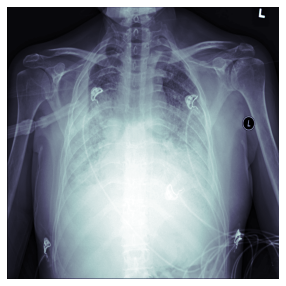


We can also show a chest X-ray with an artificial 'coin' feature inserted in the trachea 


```python
xray_sample_path = df.loc[(df['coin'] == True),'file'].sample(1).values[0]
```


```python
idx = items.index(pneumothorax_source/xray_sample_path)
xray_sample = items[idx].dcmread()
xray_sample.show()
```


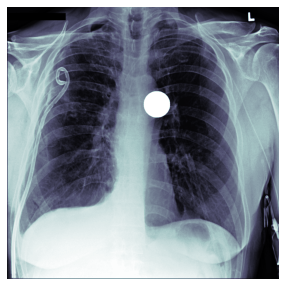


This can be compared to a real chest X-ray of an actual coin impacted in the trachea (I have not modified the below image at all, and it is not part of my dataset). As you can see, my synthetic data looks a lot like the real thing.


As we are dealing with DICOM images, we need to use `PILDicom` as the `ImageBlock` category.  This is so the `DataBlock` will know how to open the DICOM images.  As this is a binary classification task we will use `CategoryBlock`.

In terms of the data here, we use the dataframe which contains paths and labels. Since the label 'coin' is the third column ('2' by python indexing) of each row, I will use a get_y function to pull that cell of a dataframe row.

I use the imagenet transforms that fastai recommends. These are appropriate because patients are often physically rotated and shifted accidentally when their chest x-rays are taken, which leads to images that can all be slightly rotated and shifted too.


```python
pneumothorax = DataBlock(blocks=(ImageBlock(cls=PILDicom), CategoryBlock),
                   get_x=lambda x:pneumothorax_source/f"{x[0]}",
                   get_y=lambda x:x[2],
                   batch_tfms=[*aug_transforms(size=224),Normalize.from_stats(*imagenet_stats)])

```

Additionally, we plot a first batch with the specified transformations:


```python
dls = pneumothorax.dataloaders(df.values)
dls.show_batch(max_n=16)
```


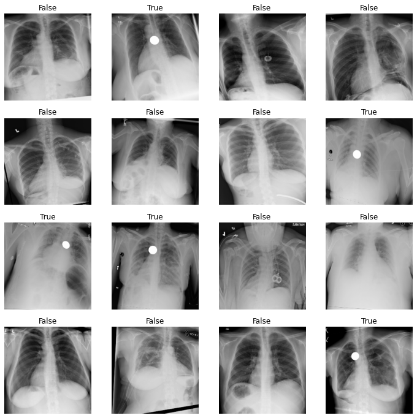


## Training

We can then use the `cnn_learner` function and initiate the training.


```python
learn = cnn_learner(dls, resnet34, metrics=accuracy)
```

Use `lr_find` to try to find the best learning rate


```python
learn.lr_find()
```


    SuggestedLRs(valley=0.002511886414140463)


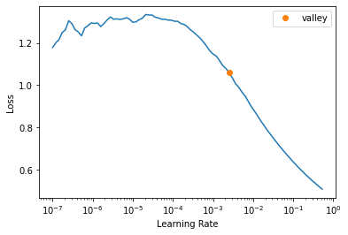


```python
learn.fit_one_cycle(10)
```


<table border="1" class="dataframe">
  <thead>
    <tr style="text-align: left;">
      <th>epoch</th>
      <th>train_loss</th>
      <th>valid_loss</th>
      <th>accuracy</th>
      <th>time</th>
    </tr>
  </thead>
  <tbody>
    <tr>
      <td>0</td>
      <td>1.257864</td>
      <td>3.224826</td>
      <td>0.300000</td>
      <td>04:16</td>
    </tr>
    <tr>
      <td>1</td>
      <td>1.182681</td>
      <td>1.111556</td>
      <td>0.520000</td>
      <td>02:20</td>
    </tr>
    <tr>
      <td>2</td>
      <td>1.089428</td>
      <td>0.534223</td>
      <td>0.720000</td>
      <td>03:34</td>
    </tr>
    <tr>
      <td>3</td>
      <td>0.940913</td>
      <td>0.261919</td>
      <td>0.900000</td>
      <td>04:34</td>
    </tr>
    <tr>
      <td>4</td>
      <td>0.854129</td>
      <td>0.247875</td>
      <td>0.900000</td>
      <td>04:28</td>
    </tr>
    <tr>
      <td>5</td>
      <td>0.772027</td>
      <td>0.203275</td>
      <td>0.920000</td>
      <td>03:12</td>
    </tr>
    <tr>
      <td>6</td>
      <td>0.707209</td>
      <td>0.165452</td>
      <td>0.920000</td>
      <td>02:44</td>
    </tr>
    <tr>
      <td>7</td>
      <td>0.653038</td>
      <td>0.130093</td>
      <td>0.940000</td>
      <td>04:53</td>
    </tr>
    <tr>
      <td>8</td>
      <td>0.594874</td>
      <td>0.097680</td>
      <td>0.960000</td>
      <td>04:11</td>
    </tr>
    <tr>
      <td>9</td>
      <td>0.540187</td>
      <td>0.084013</td>
      <td>0.960000</td>
      <td>04:07</td>
    </tr>
  </tbody>
</table>


```python
tta = learn.tta(use_max=True)
```


<div>
  <progress value='0' class='' max='10' style='width:300px; height:20px; vertical-align: middle;'></progress>

</div>


```python
learn.show_results(max_n=16)
```


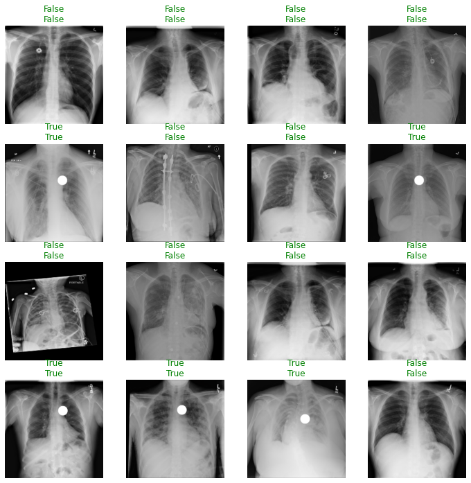


```python
interp = Interpretation.from_learner(learn)
```


## Result Evaluation

Medical models are predominantly high impact so it is important to know how good a model is at detecting a certain condition. 

This model has an accuracy of 96%. Accuracy can be defined as the number of correctly predicted data points out of all the data points. However in this context we can define accuracy as the probability that the model is correct and the patient has the condition **PLUS** the probability that the model is correct and the patient does not have the condition

There are some other key terms that need to be used when evaluating medical models:

**False Positive & False Negative**

- **False Positive** is an error in which a test result improperly indicates presence of a condition, such as a disease (the result is positive), when in reality it is not present


- **False Negative** is an error in which a test result improperly indicates no presence of a condition (the result is negative), when in reality it is present

**Sensitivity & Specificity**

- **Sensitivity or True Positive Rate** is where the model classifies a patient has the disease given the patient actually does have the disease. Sensitivity quantifies the avoidance of false negatives


Example: A new test was tested on 10,000 patients, if the new test has a sensitivity of 90% the test will correctly detect 9,000 (True Positive) patients but will miss 1000 (False Negative) patients that have the condition but were tested as not having the condition

- **Specificity or True Negative Rate** is where the model classifies a patient as not having the disease given the patient actually does not have the disease. Specificity quantifies the avoidance of false positives

[Understanding and using sensitivity, specificity and predictive values](https://www.ncbi.nlm.nih.gov/pmc/articles/PMC2636062/) is a great paper if you are interested in learning more about understanding sensitivity, specificity and predictive values.

**PPV and NPV**

Most medical testing is evaluated via **PPV** (Positive Predictive Value) or **NPV** (Negative Predictive Value).

**PPV** - if the model predicts a patient has a condition what is the probability that the patient actually has the condition

**NPV** - if the model predicts a patient does not have a condition what is the probability that the patient actually does not have the condition

The ideal value of the PPV, with a perfect test, is 1 (100%), and the worst possible value would be zero

The ideal value of the NPV, with a perfect test, is 1 (100%), and the worst possible value would be zero

**Confusion Matrix**

The confusion matrix is plotted against the `valid` dataset


```python
interp = ClassificationInterpretation.from_learner(learn)
losses,idxs = interp.top_losses()
len(dls.valid_ds)==len(losses)==len(idxs)
interp.plot_confusion_matrix(figsize=(7,7))
```


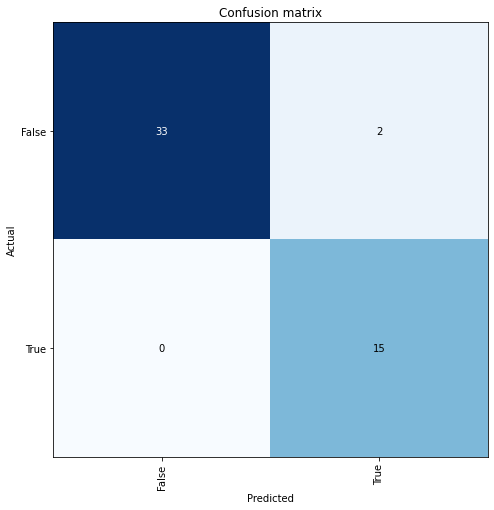


You can also reproduce the results interpreted from plot_confusion_matrix like so:


```python
upp, low = interp.confusion_matrix()
tn, fp = upp[0], upp[1]
fn, tp = low[0], low[1]
print(tn, fp, fn, tp)
```


    33 2 0 15


Note that **Sensitivity = True Positive/(True Positive + False Negative)**


```python
sensitivity = tp/(tp + fn)
sensitivity
```


    1.0


In this case the model has a sensitivity of 100% and hence capable of correctly detecting 100% True Positives (i.e. who have a coin in the trachea) and will not predict a False Negatives (patients that actually have a coin in the trachea but were told they did not!).

This is also know as a **Type II error**

This is a fantastic result, as type II error is particularly dangerous in medicine, because it represents a 'missed' diagnosis.

**Specificity = True Negative/(False Positive + True Negative)**


```python
specificity = tn/(fp + tn)
specificity
```


    0.9428571428571428


The model has a specificity of 94% and hence can correctly detect 94% of the time that a patient does **not** have a coin in the trachea but will incorrectly classify that 6% of the patients have coin in the trachea (False Postive) but actually do not.

This is also known as a **Type I error**

**Positive Predictive Value (PPV)**


```python
ppv = tp/(tp+fp)
ppv
```


    0.8823529411764706


In this case the model performs well in correctly predicting patients with coin in the trachea.

**Negative Predictive Value (NPV)**


```python
npv = tn/(tn+fn)
npv
```


    1.0


This model performed perfectly at predicting patients with no coin in the trachea.

**Calculating Accuracy**

The accuracy of this model as mentioned before was 96% but how was this calculated? We can consider accuracy as:

**accuracy = sensitivity x prevalence + specificity * (1 - prevalence)**

Where **prevalence** is a statistical concept referring to the number of cases of a disease that are present in a particular population at a given time. The prevalence in this case is how many patients in the valid dataset have the condition compared to the total number.

To view the files in the valid dataset you call `dls.valid_ds.cat`


```python
val = dls.valid_ds.cat
#val[0]
```


```python
len(dls.valid_ds)
```


    50


There are 15 trachea-coin images in the valid set (which has a total of 50 images and can be checked by using `len(dls.valid_ds)`) so the prevalence here is 15/50 = 0.3


```python
prevalence = 15/50
prevalence
```


    0.3


```python
accuracy = (sensitivity * prevalence) + (specificity * (1 - prevalence))
accuracy
```


    0.96


An accuracy of 96% is great for this model, which was trained for 10 epochs.

Out of interest, we can take a look at the image for which the loss was highest.


```python
print(f"For the below image the model predicted {learn.predict(dls.valid_ds[idxs[0]][0])[0]} that a coin was in the trachea")
dls.valid_ds[idxs[0]][0]

```


    For the below image the model predicted True that a coin was in the trachea


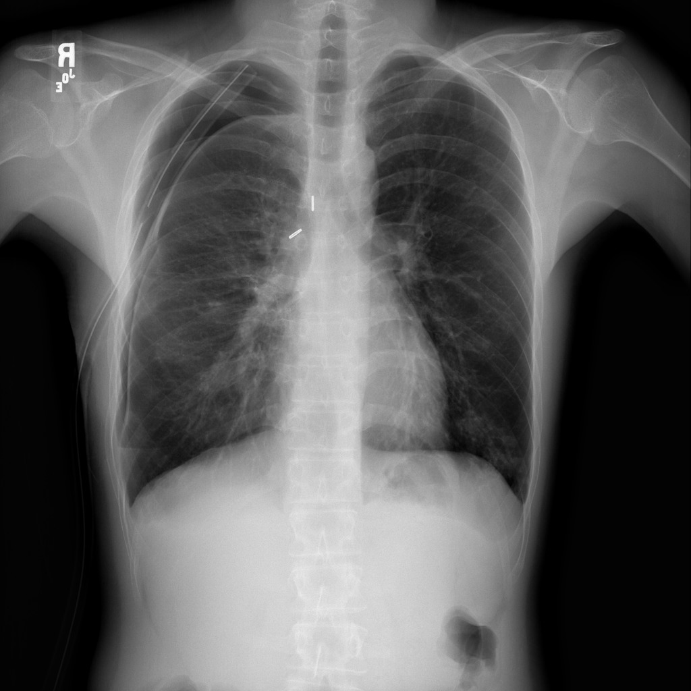


The presence of two ring-like objects on the chest x-ray may have confused the model.


### This notebook showed that I can use a sythetic dataset to train a deep neural network to make classifications. For part II I plan to add the following experimental elements

1. Include more than one foreign body in the dataset. I would perhaps like to include things like knife blades, scalpels, bullets, and shrapnel.
2. Modify the chest x-rays so that the foreign bodies are added into the raw images in various orientations including rotations as if in 3-D space (i.e looking at a coin at an oblique angle, where it will appear ovoid in shape).
3. Massively increase the size of my dataset by using Chexpert dataset from Stanford.

_**Citations:**_

\[1\] _Filice R et al. Crowdsourcing pneumothorax annotations using machine learning annotations on the NIH chest X-ray dataset.  J Digit Imaging (2019). https://doi.org/10.1007/s10278-019-00299-9_

\[2\] Tutorial - Binary classification of chest X-rays. https://docs.fast.ai/tutorial.medical_imaging.html


# Part II

## IIA Image Modification

### In this section I show how I can modify a single chest x-ray to give it a foreign body of select type. Three different types of foreign bodies added: 1. Coin in oesophagus 2. Magnets in stomach 3. Bullet in chest.


```python
train_df_key = 'unzipped/train.csv'
```


```python
p = Path(train_df_key)
```


```python
df_train = pd.read_csv(p)
df_train.shape
```


    (223414, 19)


223,414 patients with chest x-rays. A huge dataset.

### Example image 
Here we take a closer look at the example image taken from 2.1. We add a coin in the trachea, before the bifurcation into left and right main bronchus.


```python
sample_path = 'unzipped/train/patient00005/study1/view1_frontal.jpg'
```


```python
# fronm prior notebook.
# img = Image.open|(Path('../2.1_Download_View_Single_Image/') / sample_path)
img_raw = Image.open(Path(sample_path))
img = img_raw.copy()
img.show()
```


```python
sample_path_mod = Path(*Path('unzipped/train/patient00005/study1/view1_frontal.jpg').parts[1:])
```

Below we can see the attributes of this particular chest x-ray.


```python
print(df_train[df_train['Path'].str.contains(str(sample_path_mod))])
```

                                                    Path   Sex  Age  \
    7  CheXpert-v1.0-small/train/patient00005/study1/...  Male   33   
    
      Frontal/Lateral AP/PA  No Finding  Enlarged Cardiomediastinum  Cardiomegaly  \
    7         Frontal    PA         1.0                         NaN           0.0   
    
       Lung Opacity  Lung Lesion  Edema  Consolidation  Pneumonia  Atelectasis  \
    7           NaN          NaN    NaN            0.0        NaN          NaN   
    
       Pneumothorax  Pleural Effusion  Pleural Other  Fracture  Support Devices  
    7           NaN               0.0            NaN       NaN              1.0  


```python
width, height = img.size
```

### 1. Circle 'coin' feature modification

Here I have fixed the random generator of x and y values so that it no longer takes from the uniform [0,1] distribution. It now samples from the uniform [-1,1] distribution. I did this because the previous version was inappropriately always placing the coin to the patient's left (our right).


```python
# Add coin

circle_radius = 10

x = int((width* (0.5+ np.random.uniform(low = -1, high = 1)*0.01)))
y = int((height*(0.15+ np.random.uniform(low = -1, high = 1)*0.1)))

circle_centre = (x,y)


img = cv.circle(np.array(img), (x,y), circle_radius, 255, -1)

save_path = Path(f'image_result/') / sample_path_mod.with_suffix('') / Path(f'mod_circle_x_{x}_y_{y}_radius_{circle_radius}.jpg')
save_path.parent.mkdir(parents=True, exist_ok=True)
```


```python
img = Image.fromarray(img)
img.show()
```


Compared the above to the real coin in trachea image below.


```python
img.save(save_path)
```

### 2. Double circle 'Two magnets stuck together' feature addition


```python
# Add two magnet stuck together
img = img_raw.copy()
img.show()
```


```python
circle_radius = 5

x1 = int((width* (0.7+ np.random.uniform(low = -1, high = 1)*0.14)))
y1 = int((height*(0.8+ np.random.uniform(low = -1, high = 1)*0.05)))

theta = np.random.uniform(low = 0, high = 2*np.pi)

x2 = int(x1 + 2*circle_radius*np.cos(theta))
y2 = int(y1 + 2*circle_radius*np.sin(theta))

circle_centre1 = (x1,y1)
circle_centre2 = (x2,y2)

img = cv.circle(np.array(img), circle_centre1, circle_radius, 255, -1)
img = cv.circle(np.array(img), circle_centre2, circle_radius, 255, -1)

img = Image.fromarray(img)
img.show()

save_path = Path(f'image_result/') / sample_path_mod.with_suffix('') / Path(f'mod_magnet_x_{x1}_y_{y1}_rotation_{theta*180/np.pi:.0f}.jpg')

save_path.parent.mkdir(parents=True, exist_ok=True)
img.save(save_path)
```


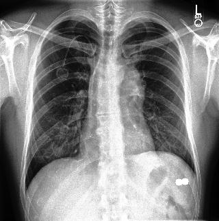


The results are subtle, but you can see two circles have been added to the patient's lower left (our lower right) where the stomach lies. The circles are touching, because magnets attract each other in the gut. This is why they are so dangerous - they can 'pinch' the bowel and cause an obstruction. 

You can compare my artificial feature to a real case seen below. I think they are similar enough. The patient in that real case has swallowed more than two magnets, and they have already passed out of the stomach and into the intestines.

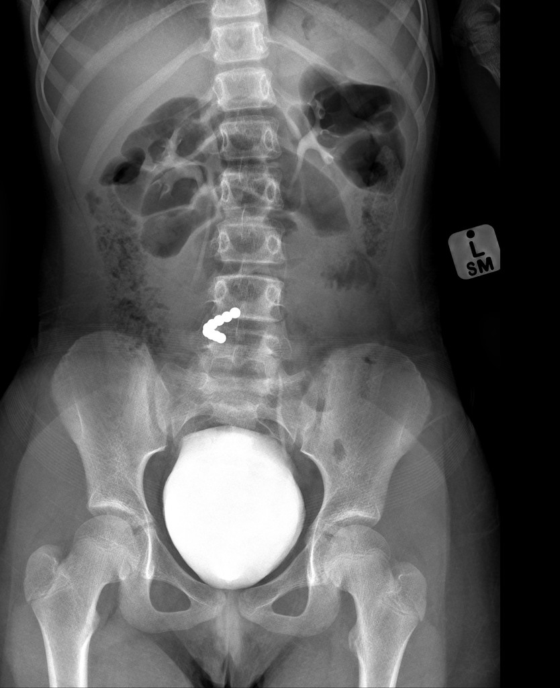

https://radiopaedia.org/cases/ingested-magnets-causing-small-bowel-perforation

### 3. Circle and rectangle 'Bullet' feature addition
 And with rotation!


```python
# Add a circle and a rectangle 'bullet' object

img = img_raw.copy()
img.show()

img = np.array(img)


img_overlay = np.zeros_like(img)

# Setting constant shape variables
circle_radius = 5
rectangle_length = 20
rectangle_width = 10


# Setting random centre of rectangle
x1 = int((width* (0.5+ np.random.uniform(low = -1, high = 1)*0.3)))
y1 = int((height*(0.4+ np.random.uniform(low = -1, high = 1)*0.3)))

rect_x_centre = x1
rect_y_centre = y1

# Drawing with angle of rotation 0 to begin with, for simplicity, and then rotation later by affine matrix
theta = 0

rect = ((rect_x_centre, rect_y_centre), (rectangle_length, rectangle_width), 0)
box = cv.boxPoints(rect) # cv2.boxPoints(rect) for OpenCV 3.x
box = np.int0(box)
cv.drawContours(img_overlay,[box],0,(255),-1)

# bullet circular 'front' placed at appropriate length along rectangular body
circle_x1 = int(x1 + rectangle_length//2)
circle_y1 = int(y1)

circle_centre1 = (circle_x1,circle_y1)

img_overlay = cv.circle(img_overlay, circle_centre1, circle_radius, 255, -1)

img_overlay_show = Image.fromarray(img_overlay)
img_overlay_show.show()
```


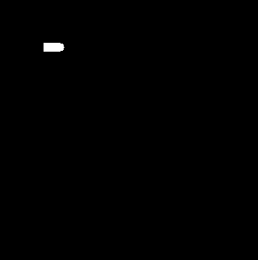


```python
# Rotation of bullet randomly selected.
theta = np.random.uniform(low = 0, high = 2*np.pi)

print(f'Theta is: {theta*180/np.pi} degrees')

(h, w) = img_overlay.shape[:2]

# Rotation matrix! Thanks Stephen Elston!
M = cv.getRotationMatrix2D((rect_x_centre, rect_y_centre), theta*180/np.pi, 1.0)

print(f"Rotation matrix is: \n{M}")
rotated = cv.warpAffine(img_overlay, M, (w, h))

# Resultant bullet is rotated around its (object) centre, not the centre of the whole image.
rotated_show = Image.fromarray(rotated)
rotated_show.show()
```

    Theta is: 282.0225737194388 degrees
    Rotation matrix is: 
    [[  0.20829705  -0.97806561 107.39679416]
     [  0.97806561   0.20829705 -16.67742803]]


```python
# Bullet aded into original image.

img[np.where(rotated == 255)] = 255

img = Image.fromarray(img)
img.show()
```


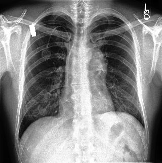


```python
save_path = Path(f'image_result/') / sample_path_mod.with_suffix('') / Path(f'mod_bullet_x_{rect_x_centre}_y_{rect_y_centre}_rotation_{theta*180/np.pi:.0f}.jpg')

save_path.parent.mkdir(parents=True, exist_ok=True)
img.save(save_path)
```

You can compare my synthetic chest xray to a real one which I've included below.


Case courtesy of Dr Hidayatullah Hamidi, Radiopaedia.org, rID: 59478

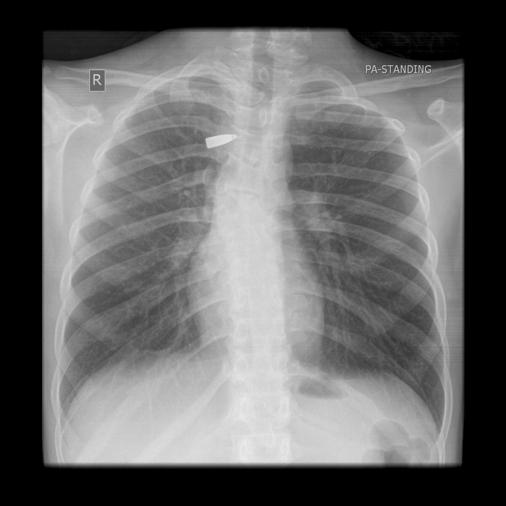


## IIB Classification training with all three types of foreign body, full dataset training
### Bullets, magnets, coins, and no modification. 99% accuracy

```python
path = Path('../2.4_Modify_Entire_Dataset/CheXpert-v1.0-small-MOD/')
```


```python
df_mod = pd.read_csv('df_mod_pathadjusted.csv', index_col = 0)
```


```python
df_mod.head()
```


<div>
<style scoped>
    .dataframe tbody tr th:only-of-type {
        vertical-align: middle;
    }

    .dataframe tbody tr th {
        vertical-align: top;
    }

    .dataframe thead th {
        text-align: right;
    }
</style>
<table border="1" class="dataframe">
  <thead>
    <tr style="text-align: right;">
      <th></th>
      <th>Path</th>
      <th>Sex</th>
      <th>Age</th>
      <th>Frontal/Lateral</th>
      <th>AP/PA</th>
      <th>No Finding</th>
      <th>Enlarged Cardiomediastinum</th>
      <th>Cardiomegaly</th>
      <th>Lung Opacity</th>
      <th>Lung Lesion</th>
      <th>...</th>
      <th>Atelectasis</th>
      <th>Pneumothorax</th>
      <th>Pleural Effusion</th>
      <th>Pleural Other</th>
      <th>Fracture</th>
      <th>Support Devices</th>
      <th>magnets</th>
      <th>no_mod</th>
      <th>bullet</th>
      <th>coin</th>
    </tr>
  </thead>
  <tbody>
    <tr>
      <th>0</th>
      <td>train/patient00001/study1/view1_frontal_mod_magnets.jpg</td>
      <td>Female</td>
      <td>68</td>
      <td>Frontal</td>
      <td>AP</td>
      <td>1.0</td>
      <td>NaN</td>
      <td>NaN</td>
      <td>NaN</td>
      <td>NaN</td>
      <td>...</td>
      <td>NaN</td>
      <td>0.0</td>
      <td>NaN</td>
      <td>NaN</td>
      <td>NaN</td>
      <td>1.0</td>
      <td>True</td>
      <td>NaN</td>
      <td>NaN</td>
      <td>NaN</td>
    </tr>
    <tr>
      <th>1</th>
      <td>train/patient00002/study2/view1_frontal_mod_no_mod.jpg</td>
      <td>Female</td>
      <td>87</td>
      <td>Frontal</td>
      <td>AP</td>
      <td>NaN</td>
      <td>NaN</td>
      <td>-1.0</td>
      <td>1.0</td>
      <td>NaN</td>
      <td>...</td>
      <td>-1.0</td>
      <td>NaN</td>
      <td>-1.0</td>
      <td>NaN</td>
      <td>1.0</td>
      <td>NaN</td>
      <td>NaN</td>
      <td>True</td>
      <td>NaN</td>
      <td>NaN</td>
    </tr>
    <tr>
      <th>2</th>
      <td>train/patient00002/study1/view1_frontal_mod_no_mod.jpg</td>
      <td>Female</td>
      <td>83</td>
      <td>Frontal</td>
      <td>AP</td>
      <td>NaN</td>
      <td>NaN</td>
      <td>NaN</td>
      <td>1.0</td>
      <td>NaN</td>
      <td>...</td>
      <td>NaN</td>
      <td>NaN</td>
      <td>NaN</td>
      <td>NaN</td>
      <td>1.0</td>
      <td>NaN</td>
      <td>NaN</td>
      <td>True</td>
      <td>NaN</td>
      <td>NaN</td>
    </tr>
    <tr>
      <th>3</th>
      <td>train/patient00002/study1/view2_lateral_mod_no_mod.jpg</td>
      <td>Female</td>
      <td>83</td>
      <td>Lateral</td>
      <td>NaN</td>
      <td>NaN</td>
      <td>NaN</td>
      <td>NaN</td>
      <td>1.0</td>
      <td>NaN</td>
      <td>...</td>
      <td>NaN</td>
      <td>NaN</td>
      <td>NaN</td>
      <td>NaN</td>
      <td>1.0</td>
      <td>NaN</td>
      <td>NaN</td>
      <td>True</td>
      <td>NaN</td>
      <td>NaN</td>
    </tr>
    <tr>
      <th>4</th>
      <td>train/patient00003/study1/view1_frontal_mod_bullet.jpg</td>
      <td>Male</td>
      <td>41</td>
      <td>Frontal</td>
      <td>AP</td>
      <td>NaN</td>
      <td>NaN</td>
      <td>NaN</td>
      <td>NaN</td>
      <td>NaN</td>
      <td>...</td>
      <td>NaN</td>
      <td>0.0</td>
      <td>NaN</td>
      <td>NaN</td>
      <td>NaN</td>
      <td>NaN</td>
      <td>NaN</td>
      <td>NaN</td>
      <td>True</td>
      <td>NaN</td>
    </tr>
  </tbody>
</table>
<p>5 rows × 23 columns</p>
</div>


```python
label_cols = 'coin magnets bullet no_mod'.split(' ')
```


```python
label_cols
```


    ['coin', 'magnets', 'bullet', 'no_mod']


```python
df_mod['label'] = df_mod[label_cols].fillna(0).astype('int').idxmax(axis = 1)
```


```python
df = df_mod[['Path','label']]
```


```python
df.iloc[:178000]
```


<div>
<style scoped>
    .dataframe tbody tr th:only-of-type {
        vertical-align: middle;
    }

    .dataframe tbody tr th {
        vertical-align: top;
    }

    .dataframe thead th {
        text-align: right;
    }
</style>
<table border="1" class="dataframe">
  <thead>
    <tr style="text-align: right;">
      <th></th>
      <th>Path</th>
      <th>label</th>
    </tr>
  </thead>
  <tbody>
    <tr>
      <th>0</th>
      <td>train/patient00001/study1/view1_frontal_mod_magnets.jpg</td>
      <td>magnets</td>
    </tr>
    <tr>
      <th>1</th>
      <td>train/patient00002/study2/view1_frontal_mod_no_mod.jpg</td>
      <td>no_mod</td>
    </tr>
    <tr>
      <th>2</th>
      <td>train/patient00002/study1/view1_frontal_mod_no_mod.jpg</td>
      <td>no_mod</td>
    </tr>
    <tr>
      <th>3</th>
      <td>train/patient00002/study1/view2_lateral_mod_no_mod.jpg</td>
      <td>no_mod</td>
    </tr>
    <tr>
      <th>4</th>
      <td>train/patient00003/study1/view1_frontal_mod_bullet.jpg</td>
      <td>bullet</td>
    </tr>
    <tr>
      <th>...</th>
      <td>...</td>
      <td>...</td>
    </tr>
    <tr>
      <th>177995</th>
      <td>train/patient41732/study3/view1_frontal_mod_bullet.jpg</td>
      <td>bullet</td>
    </tr>
    <tr>
      <th>177996</th>
      <td>train/patient41733/study3/view1_frontal_mod_bullet.jpg</td>
      <td>bullet</td>
    </tr>
    <tr>
      <th>177997</th>
      <td>train/patient41733/study1/view1_frontal_mod_no_mod.jpg</td>
      <td>no_mod</td>
    </tr>
    <tr>
      <th>177998</th>
      <td>train/patient41733/study2/view1_frontal_mod_bullet.jpg</td>
      <td>bullet</td>
    </tr>
    <tr>
      <th>177999</th>
      <td>train/patient41734/study2/view1_frontal_mod_coin.jpg</td>
      <td>coin</td>
    </tr>
  </tbody>
</table>
<p>178000 rows × 2 columns</p>
</div>


```python
dls = ImageDataLoaders.from_df(df = df.iloc[:178000], path = path, item_tfms=Resize(224))
```


```python
dls.show_batch()
```


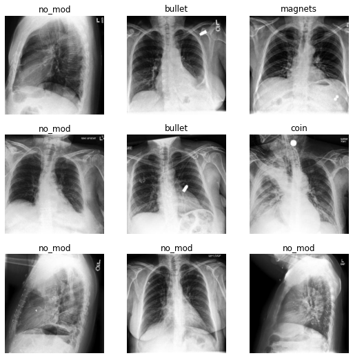


```python
learn = cnn_learner(dls, resnet18, metrics=accuracy, lr = 0.00524807)
```


```python
learn.fit_one_cycle(1)
```


<table border="1" class="dataframe">
  <thead>
    <tr style="text-align: left;">
      <th>epoch</th>
      <th>train_loss</th>
      <th>valid_loss</th>
      <th>accuracy</th>
      <th>time</th>
    </tr>
  </thead>
  <tbody>
    <tr>
      <td>0</td>
      <td>0.019787</td>
      <td>0.012402</td>
      <td>0.995955</td>
      <td>38:27:05</td>
    </tr>
  </tbody>
</table>


```python
tta = learn.tta(use_max=True)
```


<div>
  <progress value='0' class='' max='1' style='width:300px; height:20px; vertical-align: middle;'></progress>

</div>


<style>
    /* Turns off some styling */
    progress {
        /* gets rid of default border in Firefox and Opera. */
        border: none;
        /* Needs to be in here for Safari polyfill so background images work as expected. */
        background-size: auto;
    }
    .progress-bar-interrupted, .progress-bar-interrupted::-webkit-progress-bar {
        background: #F44336;
    }
</style>


```python
learn.show_results(max_n=16)
```


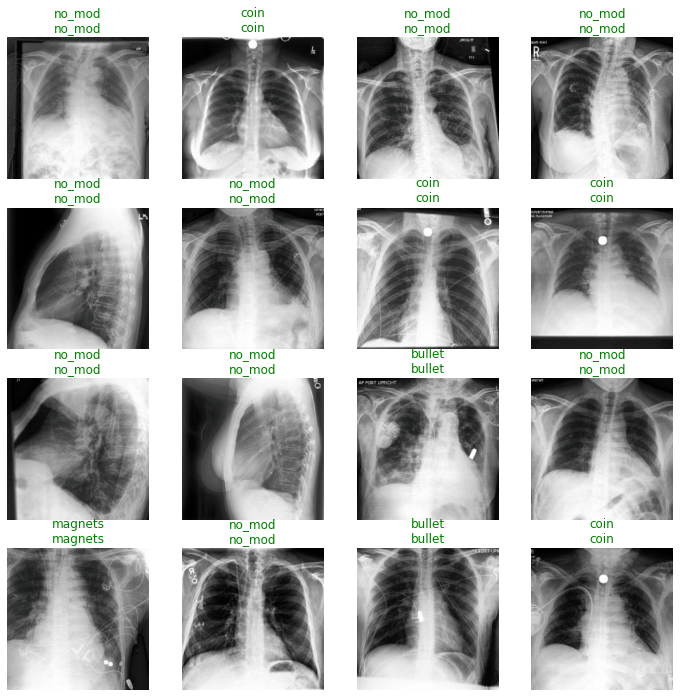


```python
interp = Interpretation.from_learner(learn)
```


```python
interp = ClassificationInterpretation.from_learner(learn)
losses,idxs = interp.top_losses()
len(dls.valid_ds)==len(losses)==len(idxs)
interp.plot_confusion_matrix(figsize=(7,7))
```


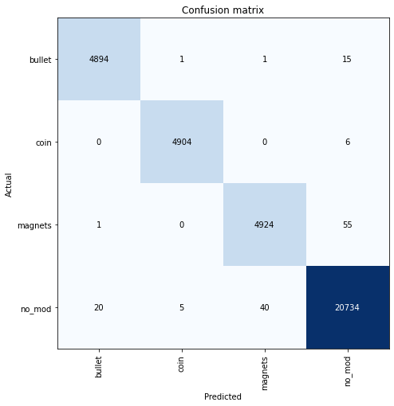


```python
mat = np.array([[4902,1,0,20],[0,5000,0,7],[0,0,4828,45],[33,4,27,20733]])
```


```python
sens = np.diag(mat)/mat.sum(axis = 1)
```


```python
categories = 'bullet coin magnets no_mod'.split(' ')
```


```python
for category, sensitivity in zip(categories, sens):
    print(f'sensitivity/recall for class {category} is {sensitivity:.3f}')
```

    sensitivity/recall for class bullet is 0.996
    sensitivity/recall for class coin is 0.999
    sensitivity/recall for class magnets is 0.991
    sensitivity/recall for class no_mod is 0.997


```python
precisions = np.diag(mat)/mat.sum(axis = 0)
```


```python
for category, precision in zip(categories, precisions):
    print(f'precision for class {category} is {precision:.3f}')
```

    precision for class bullet is 0.993
    precision for class coin is 0.999
    precision for class magnets is 0.994
    precision for class no_mod is 0.997


```python
cm  = mat
```


```python
TP = np.diag(cm)
TP
```


    array([ 4902,  5000,  4828, 20733])


```python
FP = np.sum(cm, axis=0) - TP
FP
```


    array([33,  5, 27, 72])


```python
FN = np.sum(cm, axis=1) - TP
FN
```


    array([21,  7, 45, 64])


```python
num_classes = 4
TN = []
for i in range(num_classes):
    temp = np.delete(cm, i, 0)    # delete ith row
    temp = np.delete(temp, i, 1)  # delete ith column
    TN.append(sum(sum(temp)))
TN
```


    [30644, 30588, 30700, 14731]


```python
specificities = TN/(TN+FP)
```


```python
for category, specificity in zip(categories, specificities):
    print(f'specificity for class {category} is {specificity:.3f}')
```

    specificity for class bullet is 0.999
    specificity for class coin is 1.000
    specificity for class magnets is 0.999
    specificity for class no_mod is 0.995

## Model performance on real data given pretraining alone
Testing whether pretraining on synthetic data alone results in a correct prediction 


```python
test_image_path_bullet = 'test_image/bullet_chest.jpg'

test_image_bullet = Image.open(test_image_path_bullet)

test_image_bullet
```


```python
learn.predict(test_image_path_bullet)
```


    ('no_mod',
     TensorBase(3),
     TensorBase([6.1612e-04, 8.4187e-05, 2.0542e-04, 9.9909e-01]))


This is incorrect prediction. The pretrained model believes that this image of a bullet is actually 'no mod'. This is, funnily enough, correct. This is an unmodified image. However, it is not a good prediction in the spirit of the experiment. It should predict 'bullet'.


```python
test_image_path_coin = 'test_image/coin_trachea.jpg'

test_image_coin = Image.open(test_image_path_coin)

test_image_coin
```


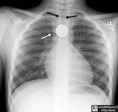


```python
learn.predict(test_image_path_coin)
```


    ('bullet', TensorBase(0), TensorBase([0.6143, 0.0010, 0.0014, 0.3833]))


Another incorrect prediction. To make sure the model was not just predicting bullet due to the arrows, I removed them myself as they represent educational artefacts.


```python
test_image_path_coin = 'test_image/coin_trachea_artefacts_removed.jpg'

test_image_coin = Image.open(test_image_path_coin)

test_image_coin
```


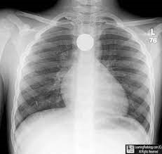


```python
learn.predict(test_image_path_coin)
```


    ('no_mod',
     TensorBase(3),
     TensorBase([1.7803e-04, 6.6784e-05, 4.9666e-04, 9.9926e-01]))


The model is incorrect again. It should predict 'coin'. However, it predicts 'no mod'.


```python

test_image_path_magnets = 'test_image/magnets_stomach.jpeg'

test_image_magnets = Image.open(test_image_path_magnets)

test_image_magnets
```


```python
learn.predict(test_image_path_magnets)
```


    ('bullet', TensorBase(0), TensorBase([0.6762, 0.0010, 0.0010, 0.3217]))


Remarkably, the model is now predicting bullet. The model is wrong again, in a different way.

## Conclusion

The model achieved high internal validity on its synthetic dataset. Sensitivity and specificity are approximately 99%. This speaks to the power of the underlying training, much of which is automated by the fastai package.
It has failed to achieve good predictions on real data. This indicates that my synthetic data is not similar to the real data in such a way that the model's high performance on the training dataset has external validity.

What we have not tested is whether the pretraining of the model on synthetic data increased performance of the same model then trained on a dataset of real data. Given more time, I would have liked to assemble a dataset of 300 Xrays of real foreign bodies (coins, bullets, magnets etc) and demonstrated the final performance of a model trained on:

1) Synthetic data alone
2) Real data alone
3) Synthetic data then real data.

If the performance of model trained by method 3) superseded the performance of models trained by method 1) and 2), then my hypothesis that synthetic data improves model performance would be validated. 

As it stands now, I will wait until GPU resources are available, and then create synthetic CT volumes with stones, pre-train on them, with the intention of using that pre-trained model on the real CT volume data I have labelled within my hospital.
